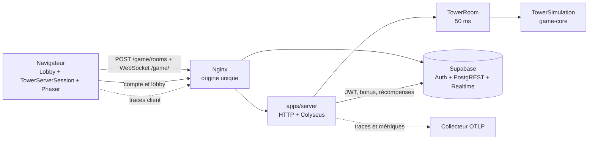

# Village Survivor — Architecture v2

> Statut : architecture implémentée — validation LAN finale à réaliser
> Version du projet : v2
> Propriétaire : Gayar
> Dernière revue : 3 août 2026
> Portée : jeu Tower, lobby, coopération, compte et exploitation LAN

## 1. Décision structurante

Toutes les parties, solo comprises, passent par un serveur de jeu autoritaire. Le navigateur
reste responsable des entrées, du rendu et des interfaces. `TowerSimulation` demeure l'unique
implémentation des règles, mais elle s'exécute exclusivement dans une `TowerRoom` en production.

Cette cible remplace le lockstep P2P d'ADR-0008. La divergence coopérative constatée a montré
qu'un calcul répliqué sur plusieurs navigateurs est une autorité fragile. Le serveur unique
supprime cette classe de divergence et centralise la validation, le cycle de vie et les
récompenses. Voir [ADR-0011](decisions/ADR-0011-authoritative-game-server.md).

## 2. Vue des composants



| Composant | Responsabilité |
|---|---|
| `apps/client` | lobby, commandes, interpolation, prédiction visuelle, rendu et UI |
| `apps/server` | authentification, création/admission, rooms, cadence, reconnexion, récompenses |
| `packages/game-core` | règles déterministes et état de simulation, sans I/O |
| `packages/protocol` | contrats réseau et projections publiques sérialisables |
| `packages/content` | catalogues de jeu partagés |
| Supabase | comptes, lobby, bonus persistants, registre des parties et récompenses |
| Nginx | origine unique pour web, REST, Realtime, OTLP et `/game/` |

## 3. Création et admission

`POST /game/rooms` reçoit un JWT Supabase et l'un des corps fermés suivants :

```typescript
type CreateTowerRoomRequest =
  | { mode: "solo" }
  | { mode: "coop"; rosterUserIds: string[] };

type CreateTowerRoomResponse = { roomId: string; expiresAt: string };
```

Le serveur vérifie le JWT, produit `runId` et seed, charge les bonus via PostgREST avec la clé
`service_role`, puis réserve les identités. Une room solo attend une identité. Une room coop
attend exactement le roster réservé pendant 15 secondes ; un membre absent annule le départ.
Le chef diffuse uniquement `roomId` dans le lobby Supabase.
La présence du hub contient identité d'affichage, rôle et ordre d'arrivée, jamais les bonus
persistants ; le serveur recharge ceux-ci directement à la création.

Le jeton reste en mémoire le temps de créer/rejoindre la room. Il n'est écrit ni dans
`sessionStorage`, ni dans les logs, ni dans la télémétrie.

## 4. Autorité et protocole

Chaque `TowerRoom` possède une seule `TowerSimulation` et l'avance toutes les 50 ms. L'état
Schema contient phase, tick, monde, joueurs, Cœur, tourelles, monstres, projectiles, ferraille,
vague, boutiques et quête. Les événements éphémères empruntent un message fiable, ordonné et
dédupliqué par l'identifiant de `TowerEvent`.
La seed reste interne à la simulation serveur. L'adaptateur fournit au contrat de rendu une
valeur sentinelle non exploitable, sans révéler la graine autoritaire.

Le contrat partagé contient `players` mais pas l'alias local `player`. `TowerServerSession`
implémente `TowerRenderableSession`, reconstruit `player` depuis l'identité locale et conserve
la scène, le HUD et les boutiques indépendants du transport.

Deux familles de messages remontent au serveur :

- `control`, remplaçable, 30/s maximum : séquence, mouvement, visée et tir continu. WebSocket
  étant fiable et Colyseus n'envoyant pas `sendUnreliable`, le client utilise `send`; le serveur
  rejette les séquences périmées et neutralise après 250 ms ;
- `action`, fiable, 10/s maximum : union fermée niveau/arme/boutique, `actionId` et file de 16.

Le serveur refuse les séquences anciennes, nombres non finis, bornes dépassées, actions
inconnues, duplications et dépassements de fréquence. Il conserve une commande continue au plus
250 ms, puis applique une entrée neutre.

## 5. Rendu et latence

Le client interpole les deux derniers états serveur. La prédiction de l'avatar local est
purement visuelle et bornée à deux ticks ; chaque nouvel état autoritaire la réinitialise. Ni
la prédiction ni l'alias `player` ne sont renvoyés au serveur.

Une indisponibilité au lancement affiche une erreur lisible et ramène au lobby. Une coupure en
partie conserve l'avatar, neutre et vulnérable, pendant une fenêtre de reconnexion de 30 secondes.
La reconnexion récupère le même avatar et un état complet. Après le délai, l'avatar est retiré à
la frontière de tick suivante et l'identité ne peut plus revenir. Une sortie volontaire est
immédiate.

## 6. Fin de room et récompenses

Le serveur conserve l'or déjà acquis par les joueurs retirés. Une défaite normale crédite tous
les participants via `finalize_game_run`, même absents. Une room sans joueur actif devient
`abandoned` et ne crédite rien. L'état terminal reste consultable 60 secondes.

`game_runs` et `game_run_rewards` constituent le journal idempotent. La RPC serveur valide les
montants, insère seulement les récompenses absentes, crédite les portefeuilles dans la même
transaction et marque la partie terminée. Sa répétition ou deux appels concurrents restent sans
effet supplémentaire.

## 7. Déploiement et secrets

Le service `game-server` rejoint `deploy/lan/docker-compose.yml`, avec healthcheck et limite
initiale de 512 Mio. Nginx relaie HTTP et WebSocket sous `/game/`. Les variables
`JWT_SECRET`, `SERVICE_ROLE_KEY`, `POSTGREST_URL`, `APP_LOG_LEVEL` et l'export OTLP existent
uniquement côté serveur.

Les rooms sont volatiles : aucun mécanisme de reprise après redémarrage n'est prévu. Ce choix
est compatible avec une ou deux rooms LAN et rend explicite qu'une panne serveur interrompt les
sessions.

## 8. Observabilité

Une room produit une trace racine `game.room`, avec enfants création, admission, démarrage,
reconnexion, persistance et fin. Les ticks et commandes alimentent des métriques agrégées, jamais
des spans. Aucune donnée d'identité ou d'authentification n'entre dans les signaux. L'export est
hors du chemin critique et sa panne n'affecte pas la simulation.

## 9. Invariants

1. `game-core` ne dépend ni de Phaser, ni du réseau, ni de l'horloge, ni d'OpenTelemetry.
2. Le navigateur ne peut pas déclarer un état ou une récompense.
3. Une room possède exactement une simulation et une cadence autoritaire.
4. L'identité vient d'un JWT vérifié et doit appartenir au roster réservé.
5. Toute récompense persistante est idempotente au niveau de la base.
6. Le chemin de production n'offre aucun mode local ou P2P.

## 10. Décisions associées

- [ADR-0002 — Simulation indépendante à pas fixe](decisions/ADR-0002-headless-fixed-step-simulation.md)
- [ADR-0003 — Frontière GameSession](decisions/ADR-0003-game-session-boundary.md)
- [ADR-0008 — Lockstep P2P](decisions/ADR-0008-p2p-lockstep-coop.md) — remplacé
- [ADR-0009 — Comptes et progression](decisions/ADR-0009-account-persistence.md)
- [ADR-0010 — Prédiction visuelle](decisions/ADR-0010-local-render-prediction.md)
- [ADR-0011 — Serveur de jeu autoritaire](decisions/ADR-0011-authoritative-game-server.md)

## 11. État de migration au 3 août 2026

Les quatre boucles sont implémentées. Solo et coopération utilisent exclusivement
`TowerServerSession`; le code de session locale/lockstep, l'historique de replay et les
empreintes P2P ont été retirés. Le chef ne diffuse que `roomId`, et les scénarios deux/quatre
clients ainsi que les coupures de 10/31 secondes sont vérifiés sur le vrai serveur.

La migration `0006`, le finaliseur PostgREST, le conteneur `game-server`, le proxy `/game/`, la
limite de 512 Mio et l'instrumentation serveur sont en place. Deux finalisations concurrentes
ont été éprouvées sur la base LAN sans double crédit. La charge de 24 000 ticks avec quatre
joueurs et 200 monstres respecte les budgets automatiques. La seule preuve encore attendue pour
clore la validation produit est une partie solo et une partie coopérative sur deux postes LAN,
avec inspection des traces distribuées.
