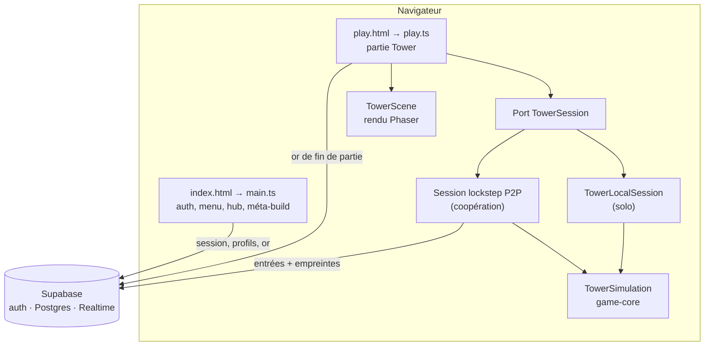

# Vue d'ensemble de l'architecture

Statut : **relevé du code au 31 juillet 2026**
Portée : le jeu « Tower », son lobby, sa coopération et sa persistance de compte.

Ce document décrit l'architecture réellement implémentée. Là où elle s'écarte du
[cadrage technique initial](../requirements/initial-technical-baseline.md), l'écart est signalé
et renvoyé vers l'ADR qui le consigne.

## 1. État actuel en une phrase

Un client web à deux pages exécute lui-même toute la simulation ; il n'existe aucun serveur de
jeu, et Supabase fournit l'authentification, une progression de compte persistante et le bus de
messages de la coopération.

## 2. Composants



| Composant | Responsabilité | Remarque |
|---|---|---|
| `apps/client` | entrées, rendu Phaser, UI, lobby, réseau, accès Supabase | contient aussi le netcode |
| `packages/game-core` | `TowerSimulation` : état et règles déterministes à pas fixe | aucune dépendance navigateur |
| `packages/protocol` | contrats sérialisables : entrées, état public, catalogue méta | aucune règle de jeu |
| `packages/content` | catalogue partagé : armes, boutique, modules, quêtes, offres | **sans schéma ni validation** |
| `supabase/migrations` | schéma Postgres, RLS et RPC | appliqué manuellement |

`apps/server` n'existe pas et n'est plus prévu à court terme — voir
[ADR-0008](../decisions/0008-p2p-lockstep-coop.md).

## 3. Les deux pages

Le client est une application à **deux points d'entrée** déclarés dans
[`apps/client/vite.config.ts`](../../apps/client/vite.config.ts). Cette séparation est
structurante, notamment parce que les deux pages n'ont pas les mêmes prérequis.

**`index.html` → `src/main.ts` — le lobby.** Authentification, menu principal, profil,
paramètres visuels, compendium, atelier de méta-build et hub multijoueur. **Cette page exige un
projet Supabase configuré** : sans `VITE_SUPABASE_URL` et `VITE_SUPABASE_ANON_KEY`, elle affiche
un écran « Configuration requise » et rien d'autre n'est accessible.

**`play.html` → `src/play.ts` — la partie.** Assemble la session, la scène de rendu, le HUD, la
boutique de tourelle, l'écran de montée de niveau et la capture des entrées. **Cette page
fonctionne sans Supabase** : ses appels au compte sont tardifs et enveloppés, si bien qu'une
partie solo démarre et se termine normalement hors ligne. Le lobby lui transmet la graine par
l'URL, et la configuration coopérative par `sessionStorage`.

## 4. Frontière de session

Le client dépend d'un port `TowerSession`, de même forme que le `GameSession` défini par
[ADR-0003](../decisions/0003-game-session-boundary.md) :

```typescript
export interface TowerSession {
  start(): Promise<void>;
  stop(): Promise<void>;
  sendInput(input: TowerInput): void;
  subscribe(listener: (state: TowerGameState) => void): () => void;
}
```

Deux implémentations le satisfont, toutes deux dans
[`apps/client/src/net/towerSession.ts`](../../apps/client/src/net/towerSession.ts) :
`TowerLocalSession` pour le solo, et une session lockstep pour la coopération. `TowerScene` ne
connaît que le port : elle fonctionne à l'identique dans les deux modes. Le principe d'ADR-0003
est donc respecté, et le jour où un serveur autoritaire apparaîtra, il remplacera un adaptateur.

La session ajoute `getRenderAlpha()` — la fraction de progression vers le prochain tick, pour
interpoler l'affichage — et `onConnectionIssue()`, qui remonte les incidents réseau sans coupler
le netcode au DOM.

## 5. Modèle d'exécution

### Temps

La simulation avance par ticks fixes de **50 ms (20 Hz)**, constante partagée entre le moteur et
le netcode. Un accumulateur convertit le temps réel en zéro, un ou plusieurs ticks, avec un
plafond d'avance par frame. Aucune règle ne lit l'horloge système.

### Déterminisme

Le déterminisme n'est pas une commodité de test : le lockstep en dépend entièrement. Il est
tenu et vérifiable — `packages/game-core/src` ne contient **aucun** appel à `Math.random`,
`Date.now`, `performance.now`, ni aucun accès au DOM. Tout l'aléatoire de gameplay passe par
`SeededRandom`, initialisé par la graine de la partie.

Les éléments qui pourraient dériver sont dérivés de valeurs pures plutôt que tirés : la rotation
des biomes, les offres du marchand et les offres de défense globale se calculent depuis la graine
et le numéro de vague.

### État

`TowerGameState` est une projection immuable et sérialisable. L'avatar local y figure sous
`player` et se retrouve toujours dans `players`. Les événements d'un tick sont distincts de
l'état persistant. Les identifiants d'entités sont stables pendant la partie.

## 6. Coopération

Modèle : **lockstep pair-à-pair déterministe**, transporté par un canal de diffusion Supabase
Realtime. Chaque pair exécute la même simulation et n'échange que des entrées, jamais d'état.
Les entrées partent avec deux ticks de retard, par lots de douze. Une empreinte d'état est
comparée tous les vingt ticks pour détecter une divergence. Les arrivées et départs sont
ordonnés par des événements planifiés à une frontière de tick explicite. Un pair peut rejoindre
en cours de partie en rejouant la graine puis l'historique d'entrées.

Toute donnée reçue du réseau est validée contre une grammaire fermée avant d'être appliquée, et
les tailles de paquet, l'avance en ticks et les longueurs d'identifiant sont bornées.

Ce modèle **remplace** le serveur Colyseus autoritaire décidé par ADR-0004, sans qu'aucun
arbitrage humain n'ait eu lieu, et il n'offre aucune protection contre la triche. Le détail et
les questions ouvertes sont dans [ADR-0008](../decisions/0008-p2p-lockstep-coop.md).

## 7. Compte et persistance

Supabase remplit trois rôles distincts :

1. **authentification** — email/mot de passe, Google, GitHub, TOTP ;
2. **persistance de compte** — or, profils de personnage, bénédictions, compétences, gemmes,
   statistiques, amis ; quatre migrations dans `supabase/migrations` ;
3. **transport temps réel** — présence, invitations, et le bus de messages de la coopération.

La sécurité repose sur les politiques RLS : chaque compte ne lit et n'écrit que ses propres
lignes, l'identité venant du JWT via `auth.uid()` et jamais d'un paramètre. Le client n'utilise
que la clé publique `anon`.

La limite connue : la simulation étant hébergée par le navigateur, **l'or crédité en fin de
partie est déclaré par le client**. Voir [ADR-0009](../decisions/0009-account-persistence.md).

## 8. Rendu

`TowerScene` dessine le monde en **mode immédiat** dans des objets `Graphics` effacés et
redessinés à chaque frame, plus une minimap fixée à l'écran. Les positions rendues sont
interpolées entre deux états de simulation à l'aide de `getRenderAlpha()`. Aucun asset n'est
chargé : tout est géométrique.

Les couleurs sont paramétrables par le joueur (`apps/client/src/preferences`) et n'influencent
jamais la simulation.

Le HUD, la boutique de tourelle, l'écran de niveau, le menu d'échappement et l'écran de fin sont
du DOM classique, alimentés par le même état.

## 9. Contenu et équilibrage

Le contenu partagé entre le moteur et l'interface vit dans `packages/content/src/tower.ts` :
armes, boutique de tourelle, modules, super-modules, priorités de ciblage, offres de défense
globale, quêtes et rotations.

Le reste du réglage — statistiques des joueurs, des tourelles et des monstres, courbe
d'expérience, budget de vagues, raretés — vit dans
`packages/game-core/src/tower/tuning.ts`, **à l'intérieur du moteur**.

C'est un écart assumé dans le code mais non arbitré : `REQ-CONTENT-001` demande que les
paramètres d'équilibrage ne soient pas dispersés dans la simulation, et ADR-0005 exige un schéma
explicite et une validation au chargement. Le catalogue Tower n'a ni schéma ni validation, alors
que l'ancien contenu était validé par Zod.

## 10. Observabilité

**Il n'existe aucune API de débogage.** L'ancienne `window.__VILLAGE_SURVIVOR_DEBUG__` a disparu
avec l'ancien jeu ; plus aucun fichier source ne la définit. Les métriques de développement
— FPS, durée de tick, nombre d'entités, graine, tick courant — ne sont plus exposées non plus.

Ce qui subsiste : les messages de console du netcode, et un bandeau d'état de synchronisation
visible en coopération.

C'est la principale régression d'observabilité du projet. Elle explique aussi pourquoi les tests
navigateur ne sont plus exécutables : ils pilotaient le jeu par cette API.

## 11. Tests

| Niveau | Objet | Outil | État |
|---|---|---|---|
| Unitaire et simulation | règles Tower, déterminisme, roster, quêtes, atelier | Vitest | **couvert** |
| Contrat de session | barrière de démarrage, roster lockstep | Vitest | **couvert** |
| Services de compte | validation des profils, statistiques, temps réel | Vitest | **couvert** |
| Interface | HUD, boutique, écran de méta-build | Vitest | **couvert** |
| Performance | coût d'un tick sous charge, coût d'une projection | Vitest | **couvert** |
| Smoke de production | le jeu démarre, pas d'API de débogage, pas d'injection par la graine | Playwright | **couvert** |
| Lobby (bout en bout) | connexion, hub, lancement coopératif | Playwright | **absent** |

Le smoke test vise `play.html`, qui démarre sans projet Supabase : il est donc exécutable en
intégration continue, où aucune clé n'existe. Le lobby, lui, n'a aucun test de bout en bout ;
il en faudrait un mode invité ou un mock de l'authentification.

Le benchmark mesure le coût **par tick réellement simulé** et s'arrête à la défaite, de sorte
que la mesure reste valable si l'équilibrage évolue. Ordre de grandeur observé : 220 µs par tick
avec 200 monstres, 17 µs par projection d'état.

## 12. Dette structurelle

L'ancien jeu M1 — `GameScene`, `LocalSession`, `coopSession`, le module `render/`, les écrans
d'inventaire et d'échange, `GameSimulation` et ses systèmes, l'ancien contenu validé par Zod et
l'ancien protocole — **a été supprimé le 31 juillet 2026** : 38 fichiers et 7 612 lignes. Il
reste consultable dans l'historique Git.

Ce qui subsiste volontairement de l'ancien monde :

- `ResourceType` dans `packages/protocol`, parce que la table `player_stats` a une colonne par
  ressource et que l'écran de profil affiche encore ces compteurs ;
- les tables `coffre_balances`, `unlocked_spells` et `account_items` de la migration `0001`, non
  utilisées par le jeu actuel mais présentes dans les bases déjà déployées.

## 13. Invariants encore tenus

Malgré les ruptures, quatre garde-fous du cadrage initial tiennent et méritent d'être préservés :

1. les règles restent hors de Phaser, dans `game-core` ;
2. le client passe par un port de session et ignore l'implémentation ;
3. le pas de simulation est fixe et la graine explicite ;
4. le cœur ne dépend ni du navigateur, ni du réseau, ni du stockage.

Le quatrième est aujourd'hui ce qui rend la coopération possible. Le relâcher casserait le
lockstep avant de casser les tests.

## 14. Décisions associées

- [ADR-0001 — Monorepo pnpm](../decisions/0001-pnpm-monorepo.md)
- [ADR-0002 — Simulation indépendante à pas fixe](../decisions/0002-headless-fixed-step-simulation.md)
- [ADR-0003 — Frontière GameSession](../decisions/0003-game-session-boundary.md)
- [ADR-0005 — Contenu piloté par les données](../decisions/0005-data-driven-content.md) — non tenu par le contenu Tower
- [ADR-0007 — Rendu en mode immédiat](../decisions/0007-immediate-mode-entity-rendering.md) — partiellement caduc
- [ADR-0008 — Coopération en lockstep pair-à-pair](../decisions/0008-p2p-lockstep-coop.md)
- [ADR-0009 — Comptes Supabase et progression persistante](../decisions/0009-account-persistence.md)
